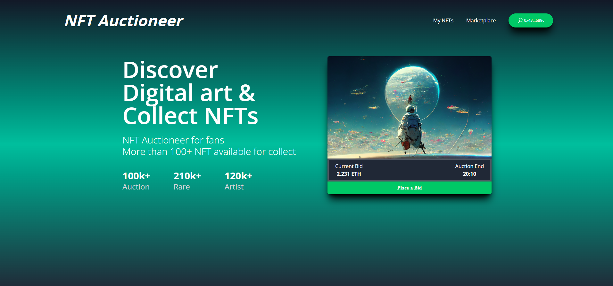

# Auction Site with React and Solidity



## Technology

This project uses:

- Metamask
- Hardhat
- Pinata
- ReactJs
- Tailwind CSS
- Solidity
- EthersJs
- Faucet

## Running the project

To run the project follow these steps:

1. Clone the project with the code below.

   ```sh
   git clone https://github.com/breavedev/nft_auction
   cd dappAution # Navigate to the new folder.
   yarn install # Installs all the dependencies.
   ```

2. Head to [Pinata](https://app.pinata.cloud/) and set up an account.

3. Create `.env` file and enter the following details.

   ```sh
   WALLET_PRIVATE_KEY=<YOUR_WALLET_PRIVATE_KEY>

   REACT_APP_PINATA_URL = <PINATA_DOMAIN_ADDRESS>
   REACT_APP_PINATA_GATEWAY_TOKEN = <PINATA_GATEWAY_KEY>
   REACT_APP_JWT = <PINATA_JWT_TOKEN>
   REACT_APP_DEFAULT_NETWORK_ID = 123
   REACT_APP_DEFAULT_NETWORK_NAME = 'Fuse Sparknet'
   ```

4. Add Fuse Sparknet to your wallet using [Chainlist](https://chainlist.org/).

5. Get some faucet from [ChainDrop](https://chaindrop.org/?chainid=123&token=0xeeeeeeeeeeeeeeeeeeeeeeeeeeeeeeeeeeeeeeee).

6. Open a terminal and run `npx hardhat run ./scripts/deploy.js --network fuse_sparknet` to deploy the auction contract.

7. Run `npm start` to spin up the app on the browser.
